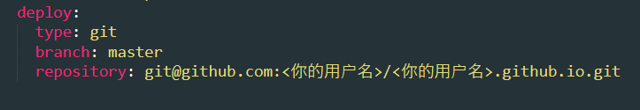

> Hexo 是一个快速、简洁且高效的博客框架。  
> Hexo 使用 Markdown（或其他渲染引擎）解析文章，在几秒内，即可利用靓丽的主题生成静态网页。  
> Github Pages是GitHub提供的一个网页寄存服务，它免费提供1GB容量存储空间以及每个月100GB流量，可以用于存放静态网页，包括博客、项目文档甚至整本书。  
> 本文利用Github Pages + Hexo的方式，免费搭建一个属于自己的博客。

## 一、前期准备

### 1、Github账号注册

### 2、配置Github Pages

> 首先，在Github.com主页点击右上角 + 号，选择 New repository进入到新建仓库的页面。  
> 在 Repository name 中，输入仓库名字，仓库名字格式必须为：你的用户名.github.io，例如你的用户名为lucky，则仓库名为lucky.github.io，且此名字用作为你的博客的专属域名。  
> 其他选项默认，拉到最下角点击 Create repository 完成仓库的新建。

### 3、配置SSH

> 网上有很多很详细的教程，在命令行中输入 `ssh-keygen -t rsa` ，  
> 连按三次回车后，在 ~/.ssh/ 文件夹中找到 id_rsa.pub 文件，  
> 打开Github.com主页，点击头像 -- Settings -- SSH and GPG keys ，  
> 在右侧点击 New SSH keys，将id_rsa.pub中的内容全部复制到Key文本框中，  
> 随便选一个Title，点击Add SSH key保存按钮，  
> 打开命令行，输入`ssh -T git@github.com`，输入`yes`回车，  
> 命令行显示 `You've successfully authenticated, but GitHub does not provide shell access.` 即表示配置成功

### 4、Git安装

> 通过git对博客工程文件进行管理以及上传到Github，进入到Git官网 `https://git-scm.com/` 傻瓜式安装即可。

### 5、Node.js安装

> Hexo基于Node.js运行，因此需要安装Node.js工具。  
> 安装过程也非常简单，进入官网 `https://nodejs.org/en/` 选择LTS版本下载安装，使用 Node.js 官方安装程序时，请确保勾选 Add to PATH 选项（默认已勾选）。  
> 安装完成后，可以在命令行中进行验证，在cmd或者Powershell中，输入 `node -version` 回车，  
> 如果得到的版本号与你方才安装的一致，那么 Node.js 就已经成功安装。  
> 输入 `npm -version` 可以验证npm软件包管理工具是否安装成功。

### 6、Hexo安装

> 输入命令 `npm install -g hexo-cli` 进行全局安装。  
> 如果进度条一直卡住不动，可能是因为服务器的原因，  
> 可以尝试输入命令 `npm config set registry https://registry.npm.taobao.org` 更换安装源后再次尝试安装。  
> 安装完成后输入命令 `hexo -v` 查看版本。

## 二、Hexo部署

### 1、初始化Hexo

> 首先先新建一个文件夹用于存放项目文件，例如 `mkdir hexo`  
> 进入文件夹后输入命令 `hexo init myBlog`，myBolg为项目名称，可以自由设置。  
> 进入到myBlog文件夹，输入命令`npm install`完成package.json文件中相关包的下载。

### 2、生成网页并本地启动

> 采用命令`hexo g`或`hexo generate`，会根据你Hexo项目中的源文件进行博客网站的生成，生成的网页都会放在public目录下。  
> 采用命令`hexo s`或`hexo server`，会在本地开启Hexo服务器，此时打开浏览器输入`localhost:4000`就可以看到你的博客网站了。  
> 如果出现Error: listen EADDRINUSE报错，可以更换本地服务器的端口，例如：`hexo server -p 5050`。  
> 在命令行中可以按Ctrl + C 关闭本地服务。

### 3、配置文件

> 打开_config.yml文件，找到`deploy`字段，按照以下的格式输入，进行Github Pages部署的配置



> 需要注意的是：每个 : 后面必须有一个空格.

### 4、创建新网页

> 输入命令 `hexo new "myFirstBlog"` 命令可以在source/_posts下生成一个同名的markdown 文件，  
> 接下来可以在这个文件下通过markdown语法进行博客内容的编辑。

### 5、Github配置（可选）

> 该步骤将配置Github仓库在项目下生成两个分支，  
> 一个分支用于保存网站原始的源代码文件，  
> 一个分支用于存放生成的博客静态文件，  
> 该配置非必选，可跳过。  
> 首先在仓库主页点击branch按钮进入到分支管理页面，点击main分支右侧的小铅笔，  
> 将main分支重命名成master分支，接着选择New branch新家一个分支，并且命名为hexo，用于存放网站的原始文件。  
> 点击仓库导航栏的settings，在左侧选择Branches，在main分支右侧点击双箭头按钮，在下拉框中将main切换从hexo分支，确认。  
> 打开myblog文件夹，依次输入命令  
> `git init`  
> `git add .`  
> `git commit -m "..."`  
> `git remote add origin git@github.com:<你的用户名>/<你的用户名>.github.io.git`  
> `git push -f origin master:hexo`  
> 成功将源代码上传至GitHub的hexo分支，并且打开仓库页面默认显示的是网站的源代码。  
>
> 注1：在日常的改动中，对博客进行修改后，依次执行  
> `git add .`  
> `git commit -m "..."`  
> `git push origin master:hexo`  
> 指令将改动推送到Github的hexo分支，接着使用 `hexo g -d`将网站发布到master分支上  
>
> 注2：在新的设备上，若想下载完整的博客代码环境，完成一、前期准备中相关环境配置后，新建一个文件夹，执行命令  
> `git clone git@github.com:<你的用户名>/<你的用户名>.github.io.git`  
> 进入到文件夹内执行  
> `npm install`  
> `npm install hexo-deployer-git`  
> 即可完成项目的本地拷贝以及开发环境的配置  

### 6、部署到Githubs

> 首先输入命令 `npm install hexo-deployer-git` 进行部署插件的安装。  
> 安装成功后，输入命令 `hexo deploy` 或 `hexo d` 进行部署的操作，  
> 若失败（例如显示错误码10054），大多为服务器问题，可切换网络或稍微等待重试几次。
> 部署成功后，进入GitHub仓库主页，点击导航栏中的Settings，Pages，在branch中选择master分支，folder选择/(root)，在点击导航栏中的Action，可以看到部署的任务，  
> 当任务变为绿色时代表GitHub Pages部署成功，可以通过访问 <你的用户名>.github.io.git 来进入到你的博客网站。

### 7、博客更新

> 1. 编辑md文件
> 1. 执行命令`hexo clean`（一般可省略）
> 1. 执行命令`hexo generate`
> 1. 执行命令`hexo server`在本地查看效果
> 1. 执行命令`hexo deploy`进行部署

## 三、其他

### 1、目录介绍

```text
.
├── .deploy_git
├── public
├── scaffolds
├── source
|   ├── _drafts
|   └── _posts
├── themes
├── _config.yml
└── package.json
```

- .deploy_git：执行命令`hexo deploy`后部署到Github上的内容目录
- public：执行命令`hexo generate`命令后生成的静态网页内容内容目录
- scaffolds：layout模板文件目录，可以修改新建文档的`Front-matter`，具体规则可以参考 [Hexo文档](https://hexo.io/zh-cn/docs/front-matter)
- source：文章源码目录
- themes：主题文件目录
- _config.yml：全局配置文件
- package.json：应用程序数据

### 2、_config.yml说明

```yaml
# Site # 整站的基本信息
title: xxx # 网站标题
subtitle: 求知，好奇，审美。就自己仅有的才能去发挥，去表达内心深刻的感觉。 # 网站副标题
description: # 网站描述，给搜索引擎用的，在生成html中的head->meta中可看到
author: xxx # 网站作者，在下方显示
email: example@gmail.com.com # 联系邮箱
language: zh-CN # 语言
timezone:

# URL # 域名和文件结构
## If your site is put in a subdirectory, set url as 'http://yoursite.com/child' and root as '/child/'
url: http://example.com # 你的域名
root: /
# 文章的永久链接，文章的链接都采用permalink下的固定格式，并通过该链接访问文章，具体格式参考[Hexo文档](https://hexo.io/zh-cn/docs/permalinks)
permalink: :year/:month/:day/:title/
permalink_defaults: null
pretty_urls:
  trailing_index: true # 设置在永久链接中保留尾部的index.html
  trailing_html: true # 设置在永久链接中保留尾部的.html

source_dir: source        # 资源文件夹
public_dir: public        # 公共文件夹
tag_dir: tags             # 标签文件夹
archive_dir: archives     # 归档文件夹
category_dir: categories  # 分类文件夹
code_dir: downloads/code  # Include Code文件夹，source_dir下的子目录
i18n_dir: ':lang'         # 国际化（i18n）文件夹
skip_render: null         # 跳过指定文件的渲染

# Writing #写文章选项
new_post_name: :title.md # 新post的文件名
default_layout: post # 默认layout方式
auto_spacing: false # 是否在中文和英文之间加入空格
titlecase: false    # 把标题转换为 title case
external_link:      # 在新标签页中打开链接
  enable: true      # true or false
  field: site       # 对全站点生效或仅对文章（post）生效
  exclude: ''       # 需要排除的域名
filename_case: 0    # 将文件名转换成小写（1）或大写（2）
render_drafts: false    # 显示草稿
post_asset_folder: true # 启动Asset文件夹
marked:     
  prependRoot: true
  postAsset: true
relative_link: false    # 把链接改为与根目录的相对位址
future: true            # 显示未来的文章
highlight:              # 代码块的高亮设置
prismjs:                # 代码块的设置
max_open_file: 100
multi_thread: true

# Category & Tag #分类与标签
default_category: uncategorized # default
# 分类别名，格式为别名:分类，可将中文别名与英文的分类进行对应，这样分类名在链接等地方都会以英文显示
category_map:   
tag_map:    # 标签别名，同分类别名

# 日期/时间格式
date_format: YYYY-MM-DD     # 日期格式
time_format: HH:mm:ss       # 时间格式
updated_option: mtime       # 当文章的Front Matter中没有指定updated时的updated值

# 分页
per_page: 10   # 每页显示的文章量，0则关闭分页功能
pagination_dir: page  # 分页目录

# Archives #存档，这里的说明好像不对。全部选择1，这个选项与主题中的选项有时候会有冲突
## 2: Enable pagination
## 1: Disable pagination
## 0: Fully Disable
archive: 1
category: 1
tag: 1

# Server #本地服务参数
## Hexo uses Connect as a server
## You can customize the logger format as defined in
## http://www.senchalabs.org/connect/logger.html
port: 4000
logger: true
logger_format:

# Extensions #插件，暂时未安装插件
## Plugins: https://github.com/tommy351/hexo/wiki/Plugins
## Themes: https://github.com/tommy351/hexo/wiki/Themes
## 主题
theme: modernist # raytaylorism # pacman # modernist # light
exclude_generator:

# 包括或不包括目录和文件
include: null   # 默认包括source/下的文件和文件夹
exclude: null   # 不包括source/下的这些文件和目录
ignore: null    # 忽略这个目录下的文件或文件夹

# Deployment #部署
## Docs: http://zespia.tw/hexo/docs/deploy.html
deploy:
  type: git
  repository: git@github.com:username/username.github.io.git
  branch: master #你的GitHub Pages仓库
```
